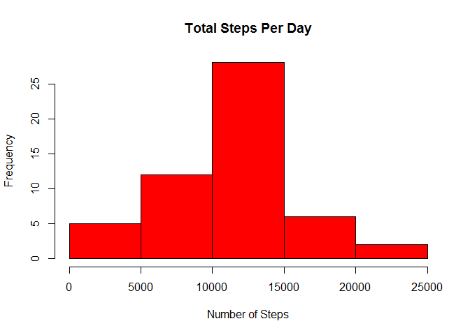
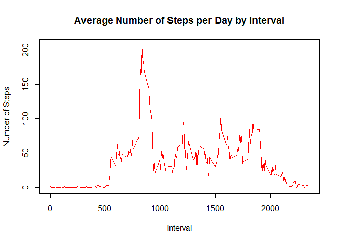
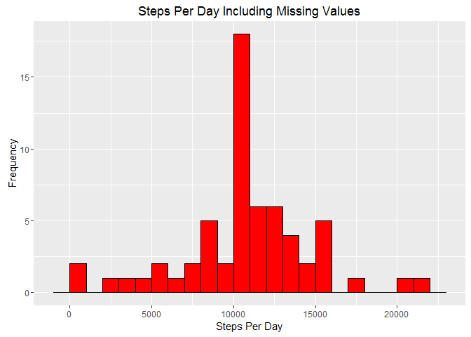
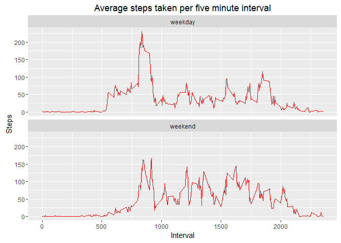

# Reproducible Research Assignment #1
Jason Ebersole  
February 6, 2016  

#Introduction

It is now possible to collect a large amount of data about personal movement using activity monitoring devices such as a Fitbit, Nike Fuelband, or Jawbone Up. These type of devices are part of the "quantified self" movement - a group of enthusiasts who take measurements about themselves regularly to improve their health, to find patterns in their behavior, or because they are tech geeks. But these data remain under-utilized both because the raw data are hard to obtain and there is a lack of statistical methods and software for processing and interpreting the data.

This assignment makes use of data from a personal activity monitoring device. This device collects data at 5 minute intervals through out the day. The data consists of two months of data from an anonymous individual collected during the months of October and November, 2012 and include the number of steps taken in 5 minute intervals each day.

The data for this assignment can be downloaded from the course web site:

   * Dataset: Activity monitoring data [52K]

The variables included in this dataset are:
   
   * **steps**: Number of steps taking in a 5-minute interval (missing values are coded as NA)
   
   * **date**: The date on which the measurement was taken in YYYY-MM-DD format
   
   * **interval**: Identifier for the 5-minute interval in which measurement was taken

The dataset is stored in a comma-separated-value (CSV) file and there are a total of 17,568 observations in this dataset.

<br><br>

# Loading and Preprocessing the Data

Show any code that is needed to:

  1. Load the data (i.e. read.csv())
  
  2. Process/transform the data (if necessary) into a format suitable for your analysis.
    
  <br>
  

```r
##Load necessary packages
library(knitr)
library(lubridate)
library(ggplot2)
library(dplyr)
```

```
## 
## Attaching package: 'dplyr'
```

```
## The following objects are masked from 'package:lubridate':
## 
##     intersect, setdiff, union
```

```
## The following objects are masked from 'package:stats':
## 
##     filter, lag
```

```
## The following objects are masked from 'package:base':
## 
##     intersect, setdiff, setequal, union
```


```r
##Reset Global Environment
rm(list= ls())

## Working Directory
setwd("C:/Users/jeber/datasciencecoursera/Reproducible_Research/Assignment_1")


## Read in the data
activity_data <- read.csv("activity.csv", header = TRUE, sep = ',', 
                          colClasses = c("numeric", "character","integer"))

## Transform the date 
activity_data$date <- ymd(activity_data$date)

##Suppress any warnings or messages
opts_chunk$set(message = FALSE, warning = FALSE)
```
     

<br><br>

#What is mean total number of steps taken per day?

For this part of the assignment, you can ignore the missing values in the dataset.

  1. Calculate the total number of steps taken per day.
  
  2. If you do not understand the difference between a histogram and a barplot, research the 
     difference between them. Make a histogram of the total number of steps taken each day.
    
  3. Calculate and report the mean and median of the total number of steps taken per day.

<br>


```r
## Steps per day
steps_per_day <- aggregate(steps ~ date, activity_data, sum)

##Histogram of Steps Per Day
hist(steps_per_day$steps, main = paste("Total Steps Per Day"), col="red", xlab="Number of Steps")
```



###What are the mean and median of the total number of steps taken per day?


```r
steps_per_day_mean <- prettyNum(mean(steps_per_day$steps) ,big.mark=",",scientific=FALSE,digits=0)

steps_per_day_median <- prettyNum(median(steps_per_day$steps) ,big.mark=",",scientific=FALSE,digits=0)
```

The **mean** of the total steps per day is **10,766** and the **median** is **10,765**. 

<br><br>

#What is the average daily activity pattern?

  1. Make a time series plot (i.e. type = "l") of the 5-minute interval (x-axis) and the average 
     number of steps taken, averaged across all days (y-axis).
     
  2. Which 5-minute interval, on average across all the days in the dataset, contains the maximum  
     number of steps?
     
<br>

```r
steps_by_interval <- aggregate(steps ~ interval, activity_data, mean)

plot(steps_by_interval$interval,
     steps_by_interval$steps, 
     type = "l", 
     col  = "red",
     xlab = "Interval", 
     ylab = "Number of Steps",
     main = "Average Number of Steps per Day by Interval")
```




```r
interval_max <- steps_by_interval[which.max(steps_by_interval$steps),1]

steps_max <- as.integer(steps_by_interval[which.max(steps_by_interval$steps),2])
```

On average, the interval **835** has the highest count of steps with **206**.

<br>
<br>

#Imputing missing values

Note that there are a number of days/intervals where there are missing values (coded as NA). The presence of missing days may introduce bias into some calculations or summaries of the data.

  1. Calculate and report the total number of missing values in the dataset 
     (i.e. the total number of rows with NAs)
     
  2. Devise a strategy for filling in all of the missing values in the 
     dataset. The strategy does not need to be sophisticated. For example, 
     you could use the mean/median for that day, or the mean for that 
     5-minute interval, etc.
     
  3. Create a new dataset that is equal to the original dataset but with the 
     missing data filled in.
  
  4. Make a histogram of the total number of steps taken each day and 
     Calculate and report the mean and median total number of steps taken 
     per day. Do these values differ from the estimates from the first part 
     of the assignment? What is the impact of imputing missing data on the 
     estimates of the total daily number of steps?

<br>

###What is the total number of missing values in the dataset?

```r
total_missing_values <- prettyNum(sum(is.na(activity_data$steps)) ,big.mark=",",scientific=FALSE,digits=0)
```

There are **2,304** total number of missing values in    the dataset.

<br>

###What is the strategy for filling in all of the missing values in the dataset?

The strategy for filling in all of the missing values in the dataset is to create a new dataset where the missing values will be replaced with the average number of steps per 5 -minute interval.

<br>

###Transform raw dataset to new clean dataset.


```r
##Raw dataset with NA values included.
clean_activity_data <- activity_data

##Remove nulls from steps
cleaned_steps <- is.na(clean_activity_data$steps)
        
##Get average steps by interval
clean_steps_interval_mean <- tapply(clean_activity_data$steps, clean_activity_data$interval, mean, na.rm=TRUE, simplify=TRUE)

##Cleaned dataset 
clean_activity_data$steps[cleaned_steps] <- clean_steps_interval_mean [as.character(clean_activity_data$interval[cleaned_steps])]
```


<br>

### Calculate the number of steps taken in each 5-minute interval per day.

```r
  steps_interval_per_day <- clean_activity_data %>%
                 filter(!is.na(steps)) %>%
                 group_by(date) %>%
                 summarize(steps = sum(steps)) %>%
                 print
```

```
## Source: local data frame [61 x 2]
## 
##          date    steps
##        (time)    (dbl)
## 1  2012-10-01 10766.19
## 2  2012-10-02   126.00
## 3  2012-10-03 11352.00
## 4  2012-10-04 12116.00
## 5  2012-10-05 13294.00
## 6  2012-10-06 15420.00
## 7  2012-10-07 11015.00
## 8  2012-10-08 10766.19
## 9  2012-10-09 12811.00
## 10 2012-10-10  9900.00
## ..        ...      ...
```

<br>

### Make a histogram of the total number of steps taken each day.

```r
  ggplot(steps_interval_per_day, aes(x = steps)) +
          
  geom_histogram(
                 fill = "red", 
                 col = "black",
                 binwidth = 1000
                 ) +
          
             labs(
                  title = "Steps Per Day Including Missing Values", 
                  x = "Steps Per Day", 
                  y = "Frequency"
                  )
```



<br>

###What are the mean and median of the total number of steps taken per day?


```r
steps_interval_per_day_mean <- prettyNum(mean(steps_interval_per_day$steps),big.mark=",",scientific=FALSE,digits=0)

steps_interval_per_day_median <- prettyNum(median(steps_interval_per_day$steps),big.mark=",",scientific=FALSE,digits=0)
```

The **mean** of the total steps per day is **10,766** and the **median** is **10,766**. 

* The mean calculated with the imputed data is the same as the mean calculated with the data that had the NA values.  However, the median (**10,766**) calculated with the imputed data is slightly different than the median (**10,765**) calculated with the data that had the NA values.  The impact of imputing missing data on the estimates of the total daily number of steps is that the mean and median both the same value - **10,766**.

<br>
<br>

#Are there differences in activity patterns between weekdays and weekends?

For this part the weekdays() function may be of some help here. Use the dataset with the filled-in missing values for this part.

  1. Create a new factor variable in the dataset with two levels - "weekday" and "weekend"
     indicating whether a given date is a weekday or weekend day.
    
  2. Make a panel plot containing a time series plot (i.e. type = "l") of 
     the 5-minute interval (x-axis) and the average number of steps taken, 
     averaged across all weekday days or weekend days (y-axis). 
     
 <br>    
 
###Create a new factor variable in the dataset with two levels - "weekday" and "weekend".

```r
clean_activity_data <- mutate(clean_activity_data, weektype = ifelse (weekdays  (clean_activity_data$date) == "Saturday"  |                         weekdays(clean_activity_data$date) == "Sunday","weekend", "weekday"))
                              
clean_activity_data$weektype <- as.factor(clean_activity_data$weektype)
```

<br>

###Make a panel plot containing a time series plot of the 5-minute interval and the average number of steps taken, averaged across all weekday days or weekend days.

```r
clean_interval <- clean_activity_data %>% 
                 group_by(interval, weektype) %>%
                 summarise(steps = mean(steps))

time_series_panel_plot <- ggplot(clean_interval, aes(x=interval, y=steps, color = weektype)) +
                          geom_line(col= "red") +
                          facet_wrap(~weektype, ncol = 1, nrow=2) +
                          labs(title="Average steps taken per five minute interval")+
                          labs(
                               x = "Interval",
                               y = "Steps"   
                               )+

                          theme(legend.title = element_text(colour="black", size=14, face="bold"))
        
print(time_series_panel_plot)
```



* There is a clear difference between weekend and weekday plots.  From the two plots, it appears the subject is more active earlier in the day during weekdays compared to weekends.  However, the subject is more active throughout the weekends compared with weekdays.  Perhaps the subject is at work during the week and as a result more sedintary.  With more freedom on the weekend, the subject can be more active.
